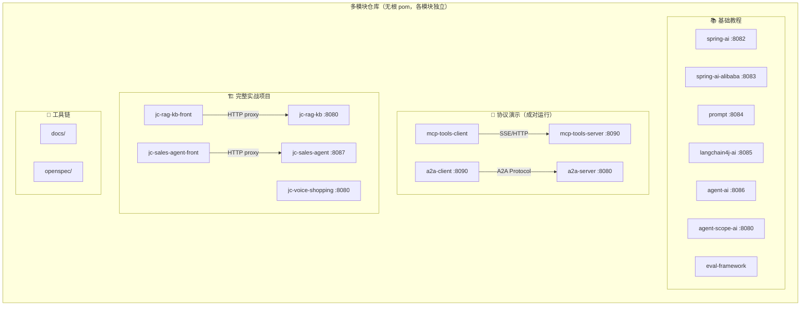
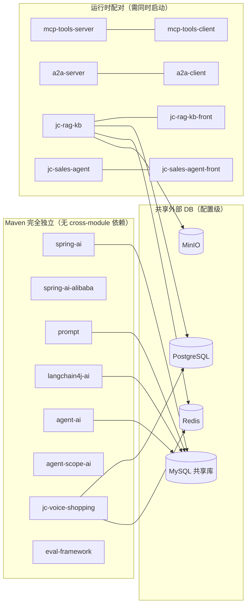
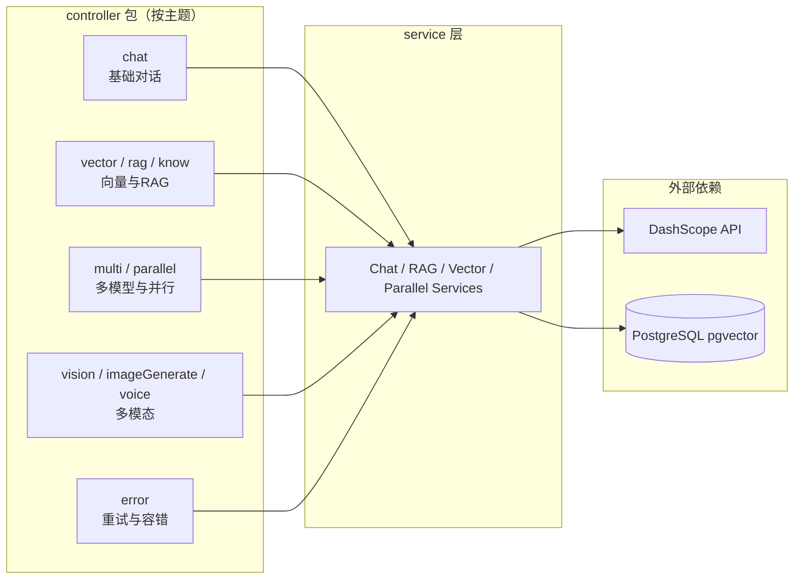
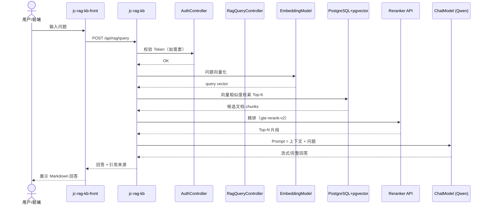
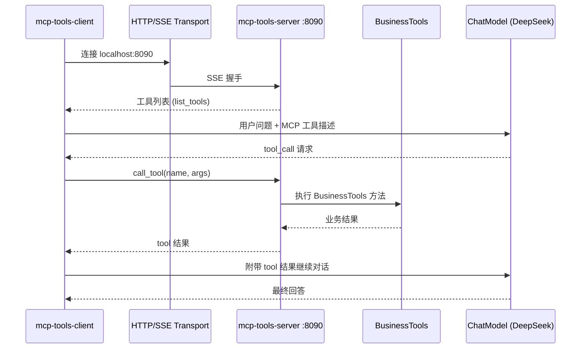
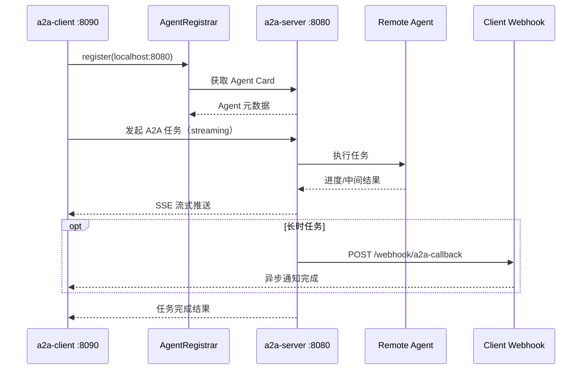
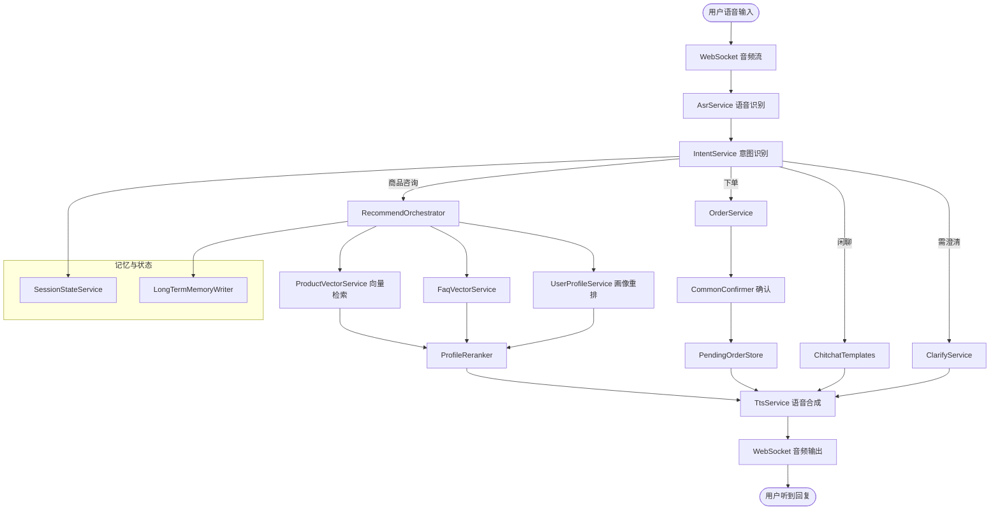
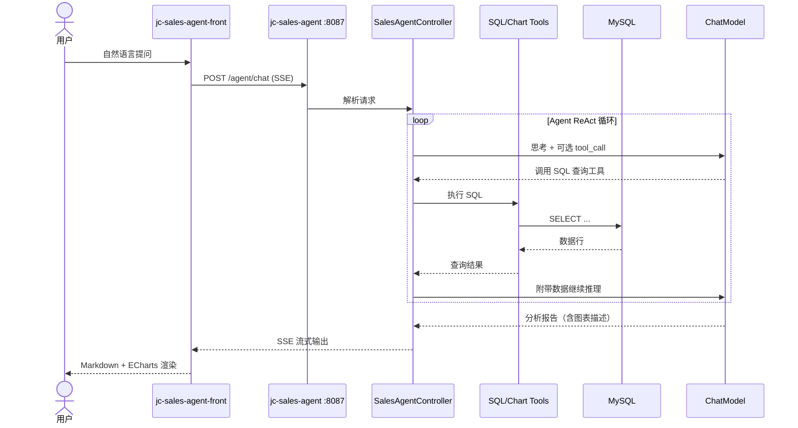

# Java AI 多模块项目 — 架构与流程图

> 基于典型 Java AI 课程代码仓库梳理，供 OpenSpec / 开发者理解多模块结构。  
> 项目背景可写入 [`openspec/config.yaml`](../openspec/config.yaml)。

---

## 1. 仓库总览

---

## 2. 子项目独立性与配对关系

---

## 3. spring-ai-alibaba 教程内部分层

---

## 4. jc-rag-kb — RAG 查询时序图

---

## 5. MCP — Server/Client 调用时序图

---

## 6. A2A — Agent 协作时序图

---

## 7. jc-voice-shopping — 语音导购流程图

---

## 8. jc-sales-agent — 销售分析 Agent 时序图

---

## 9. 端口速查表

| 端口 | 子项目 | 备注 |
|------|--------|------|
| 8080 | jc-rag-kb / jc-voice-shopping / agent-scope-ai / a2a-server | ⚠️ 冲突，不可同时启动 |
| 8082 | spring-ai | |
| 8083 | spring-ai-alibaba | |
| 8084 | prompt | |
| 8085 | langchain4j-ai | |
| 8086 | agent-ai | |
| 8087 | jc-sales-agent | |
| 8090 | mcp-tools-server / a2a-client | ⚠️ 冲突 |
| 5173 | 两个前端 dev server | Vite 默认 |

---

## 10. 维护说明

- 新增子项目后，同步更新 `openspec/config.yaml` 与本文件
- 远程 DB 地址以各模块 `application.yml` 为准
- 架构变更可通过 OpenSpec：`/opsx-propose` → `/opsx-apply` → `/opsx-archive`
